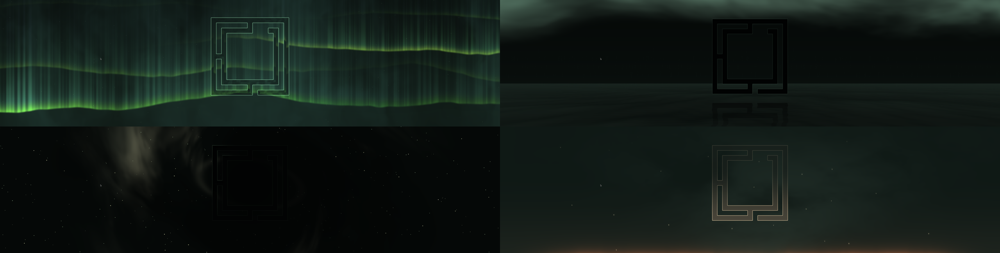

# Shader Wallpaper

An animated desktop background for Omarchy. It replaces the stock background
with a live GLSL shader that follows your theme colors, reacts to the music
that is playing, and is built around an icon of your choosing.



Styles: **aurora** (curtains of light), **thunder** (a storm over the sea),
**embers**, **nebula**, **ink** and **weather** (the sky over your actual
location, right now).

## Install

```sh
omarchy plugin add <repo-url> --enable
```

The plugin then finishes its own setup in a terminal window, the first time
the shell loads it:

1. installs what it needs if missing: `cava` (audio), `python-numpy` and
   `python-pillow` (icon rendering) — this is the one step that asks for your
   sudo password;
2. opens a file chooser and asks you to **pick a PNG** for the middle of the
   wallpaper. A shape on a transparent background works best, because the
   outline of its alpha channel is what the shader draws and bends around.
   Cancel the chooser and you get the Omarchy logo;
3. turns the wallpaper on.

If the install fails the setup simply runs again on the next shell start. You
can also run it by hand at any time: `omarchy-wallpaper-setup` (add `--pick` to
choose a new icon).

Enabling the plugin disables the stock `omarchy.background`; disabling or
removing it brings the stock one back.

## Remove

```sh
omarchy plugin remove nipe.shader-wallpaper
```

This brings the stock `omarchy.background` back. Setup leaves a few things
outside the plugin folder; delete them if you want a clean slate:

```sh
rm -f ~/.local/bin/omarchy-wallpaper-shader ~/.local/bin/omarchy-wallpaper-icon
rm -rf ~/.local/state/omarchy/wallpaper-shader ~/.config/omarchy/branding/wallpaper
rm -f ~/.config/omarchy/wallpaper-shader.conf
```

The packages it installed (`cava`, `python-numpy`, `python-pillow`) are left in
place; remove them with `omarchy pkg remove` if nothing else uses them.

## What it touches

- Installs `cava`, `python-numpy` and `python-pillow` with `omarchy-pkg-add`
  (a sudo prompt) — only when missing, only during setup.
- Disables the stock `omarchy.background` while enabled (Omarchy does this for
  any plugin that declares `clonedFrom`), and restores it on disable/remove.
- Symlinks two commands into `~/.local/bin` (never over a file that is not
  already a symlink), and creates `~/.config/omarchy/wallpaper-shader.conf` and
  `~/.config/omarchy/branding/wallpaper/` only if they do not exist. An icon
  you already set is never replaced.
- Runs a private `cava` process for audio reactivity, only while the wallpaper
  is on and the style uses audio.
- Network: the weather style calls Open-Meteo (and wttr.in for an IP-based
  location when none is set). Nothing else touches the network.
- `shaders/*.frag.qsb` are compiled shader bytecode built from the `.frag`
  sources beside them (see "Working on the shaders").

## Use

```sh
omarchy-wallpaper-shader next | prev | set <style> | list
omarchy-wallpaper-shader on | off | toggle
omarchy-wallpaper-shader audio on | off | toggle
omarchy-wallpaper-icon image        # pick another PNG
omarchy-wallpaper-icon omarchy      # back to the Omarchy logo (the default)
omarchy-wallpaper-icon none         # no icon
```

These are linked into `~/.local/bin` by the setup. To bind them to keys, add to
`~/.config/hypr/bindings.lua`, for example:

```lua
o.bind("SUPER + SHIFT + W", "Cycle shader wallpaper", "omarchy-wallpaper-shader next")
o.bind("SUPER + CTRL + W",  "Toggle shader wallpaper", "omarchy-wallpaper-shader toggle")
```

(`hl.unbind("SUPER + SHIFT + W")` first if the key already has a default binding.)

## Tuning

`~/.config/omarchy/wallpaper-shader.conf` — audio strength, how much the
pattern bends around the icon, outline glow, storm frequency, ember density,
and so on. Edits apply live. It sits outside the plugin folder so
`omarchy plugin update` never conflicts with it.

## Weather style

Uses the same location as the Omarchy weather widget (set it there, or with
`omarchy-weather-location`), falling back to your IP's location, and fetches
conditions from Open-Meteo every 15 minutes while that style is selected. The
last good answer is cached, so a network blip never blanks the sky.
`weather_preview_code` / `weather_preview_phase` in the config preview any
weather or time of day.

## Working on the shaders

Shaders are in `shaders/*.frag`, compiled next to them as `.frag.qsb` (those
are what ships):

```sh
/usr/lib/qt6/bin/qsb --qt6 -o shaders/aurora.frag.qsb shaders/aurora.frag   # qt6-shadertools
omarchy restart shell        # a recompiled .qsb does not hot-reload
journalctl --user _COMM=quickshell | grep -E 'Failed to compile|error C'
```

- The shell renders through OpenGL and Qt picks the `.qsb`'s GLSL 1.x variant,
  which rejects constant arrays (`float A[4] = float[4](...)`). `qsb` compiles
  them anyway and the wallpaper silently goes blank, so check that journal after
  every change.
- Add a style by writing `shaders/name.frag`, compiling it, and adding the name to
  `shaderNames` in `Background.qml` **and** `SHADERS` in
  `bin/omarchy-wallpaper-shader`.
- Uniforms bind by name, so a shader only declares what it uses.

## Files

| Path | Purpose |
|---|---|
| `Background.qml` | the service: renders the wallpaper, drives audio and weather |
| `shaders/` | GLSL sources and compiled `.qsb` |
| `bin/` | the commands above, the icon renderer and the setup |
| `audio-cava.conf` | the private cava instance that feeds audio reactivity |
| `wallpaper-shader.conf.default` | seed for the tuning file |
| `LICENSE` | MIT, plus the external dependencies |

## License

MIT — see `LICENSE`, which also lists the external dependencies. Weather data
is from [Open-Meteo](https://open-meteo.com).
