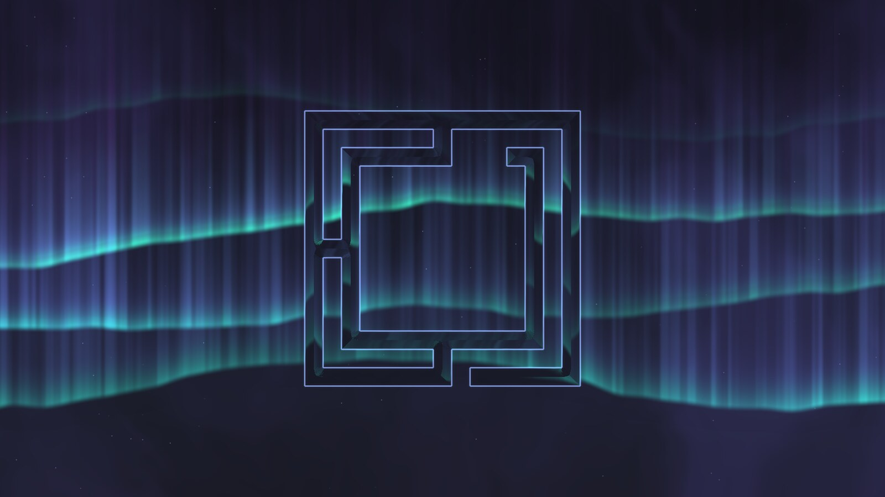
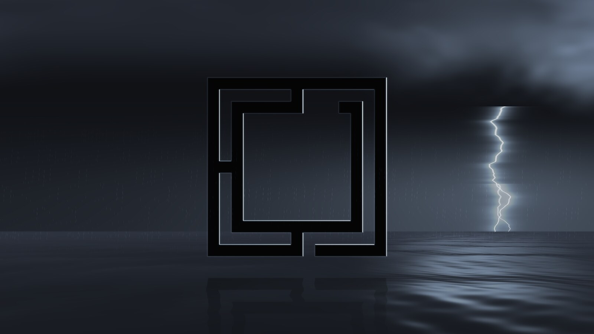
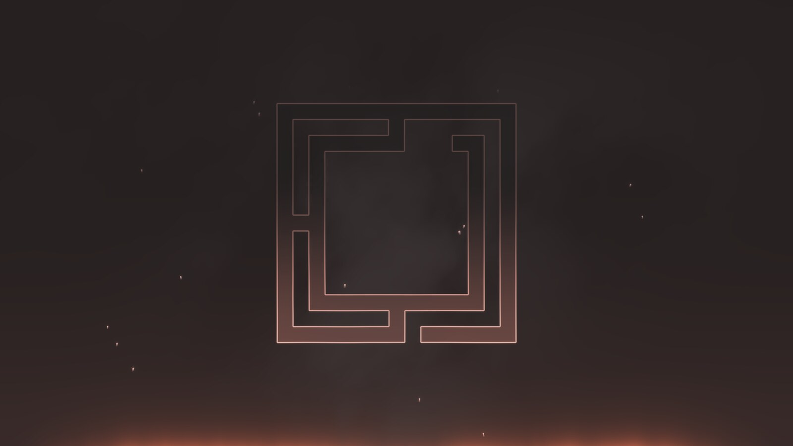
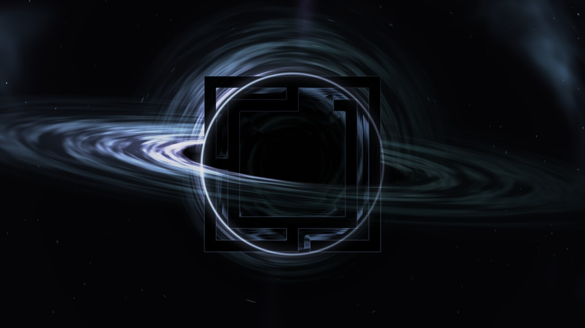
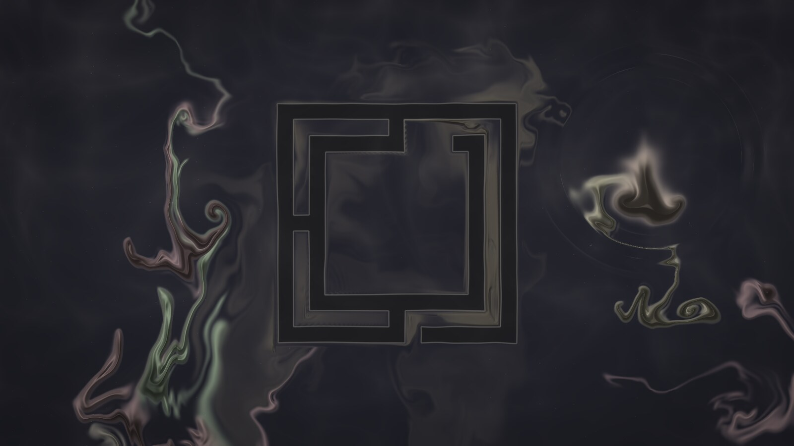
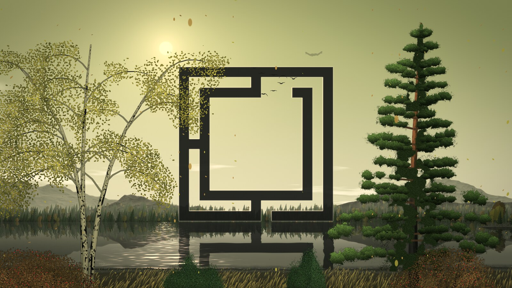
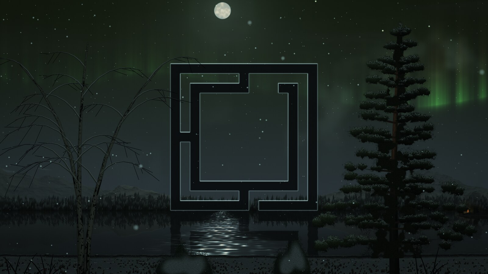

# Shader Wallpaper

An animated desktop background for Omarchy. It replaces the stock background
with a live GLSL shader that follows your theme colors, reacts to the music
that is playing, and is built around an icon of your choosing.

Six styles, all drawn around the icon in the middle and colored by the
current theme. The pictures use the default Omarchy logo and a different theme
for each style.

### Aurora

Curtains of light with folding, ray-streaked hems over a heavy haze. Music
quickens it slightly. *(Tokyo Night)*



### Thunder

A storm over the sea: a cloud deck lit from inside, rain, and the odd bolt
reaching the water, set off by loud moments in the music. *(Nord)*



### Embers

Sparks rising off a fire bed below the screen, through heat shimmer and smoke.
The beat sets how many sparks are born. *(Ristretto)*



### Nebula

The logo as a black hole: a lensed accretion disc, a photon ring, polar jets
and stars bent round the horizon. The disc pulses with the bass. *(Catppuccin)*



### Ink

A live dye simulation: drops fall into moving water, curl into filaments and
flow around the icon as if it were a solid object. *(Kanagawa)*



### Weather

A lake landscape under the sky over your actual location, right now: real sun
and moon, the current forecast, and the season from the date (see
[Weather style](#weather-style)). *(Miasma)*





## Install

```sh
omarchy plugin add <repo-url> --enable
```

The plugin then finishes its own setup in a terminal window, the first time
the shell loads it:

1. installs what it needs if missing: `cava` (audio), `python-numpy` and
   `python-pillow` (icon rendering) — this is the one step that asks for your
   sudo password;
2. opens a file chooser and asks you to **pick a PNG** for the middle of the
   wallpaper. A shape on a transparent background works best, because the
   outline of its alpha channel is what the shader draws and bends around.
   Cancel the chooser and you get the Omarchy logo;
3. turns the wallpaper on.

If the install fails the setup simply runs again on the next shell start. You
can also run it by hand at any time: `omarchy-wallpaper-setup` (add `--pick` to
choose a new icon).

Enabling the plugin disables the stock `omarchy.background`; disabling or
removing it brings the stock one back.

## Remove

```sh
omarchy plugin remove nipe.shader-wallpaper
```

This brings the stock `omarchy.background` back. Setup leaves a few things
outside the plugin folder; delete them if you want a clean slate:

```sh
rm -f ~/.local/bin/omarchy-wallpaper-shader ~/.local/bin/omarchy-wallpaper-icon
rm -rf ~/.local/state/omarchy/wallpaper-shader ~/.config/omarchy/branding/wallpaper
rm -f ~/.config/omarchy/wallpaper-shader.conf
```

The packages it installed (`cava`, `python-numpy`, `python-pillow`) are left in
place; remove them with `omarchy pkg remove` if nothing else uses them.

## What it touches

- Installs `cava`, `python-numpy` and `python-pillow` with `omarchy-pkg-add`
  (a sudo prompt) — only when missing, only during setup.
- Disables the stock `omarchy.background` while enabled (Omarchy does this for
  any plugin that declares `clonedFrom`), and restores it on disable/remove.
- Symlinks two commands into `~/.local/bin` (never over a file that is not
  already a symlink), and creates `~/.config/omarchy/wallpaper-shader.conf` and
  `~/.config/omarchy/branding/wallpaper/` only if they do not exist. An icon
  you already set is never replaced.
- Runs a private `cava` process for audio reactivity, only while the wallpaper
  is on and the style uses audio.
- Network: the weather style calls Open-Meteo (and wttr.in for an IP-based
  location when none is set). Nothing else touches the network.
- `shaders/*.frag.qsb` are compiled shader bytecode built from the `.frag`
  sources beside them (see "Working on the shaders").

## Use

```sh
omarchy-wallpaper-shader next | prev | set <style> | list
omarchy-wallpaper-shader on | off | toggle
omarchy-wallpaper-shader audio on | off | toggle
omarchy-wallpaper-shader quality high | medium | low   # see Performance
omarchy-wallpaper-shader --testing  # weather test panel (see below)
omarchy-wallpaper-icon image        # pick another PNG
omarchy-wallpaper-icon omarchy      # back to the Omarchy logo (the default)
omarchy-wallpaper-icon none         # no icon
```

These are linked into `~/.local/bin` by the setup. To bind them to keys, add to
`~/.config/hypr/bindings.lua`, for example:

```lua
o.bind("SUPER + SHIFT + W", "Cycle shader wallpaper", "omarchy-wallpaper-shader next")
o.bind("SUPER + CTRL + W",  "Toggle shader wallpaper", "omarchy-wallpaper-shader toggle")
```

(`hl.unbind("SUPER + SHIFT + W")` first if the key already has a default binding.)

## Tuning

`~/.config/omarchy/wallpaper-shader.conf` — rendering quality, audio strength, how much the
pattern bends around the icon, outline glow, storm frequency, ember density,
and so on. Edits apply live. It sits outside the plugin folder so
`omarchy plugin update` never conflicts with it.

## Weather style

A lake landscape: mountains, forest, an island, a meadow, birches and a pine,
under the sky outside your window. It uses the same location as the Omarchy
weather widget (set it there, or with `omarchy-weather-location`), falling back
to your IP's location, and fetches conditions from Open-Meteo every 15 minutes
while that style is selected. The last good answer is cached, so a network blip
never blanks the sky.

- The sun and moon follow the real sunrise, sunset and moon phase.
- Cloud, rain, snow, fog, storms and wind (speed **and** direction) come from
  the forecast; downpours and blizzards have their own heavier effects.
- The date sets the season: grass and leaves go from spring green through
  autumn colour to bare winter branches, and hard frost takes the grass away.
- Now and then something happens on its own: birds and a soaring bird of prey,
  fish rising in calm water, an aurora on clear nights, shooting stars, a
  campfire on the far shore, hikers with head torches in the mountains.

`weather_preview_code` / `weather_preview_phase` in the config preview any
weather or time of day. For trying things out, `omarchy-wallpaper-shader
--testing` shows a small panel in the bottom-right corner (weather style only)
with buttons for the weather, time of day, wind speed and direction,
temperature, season, the occasional events, and skipping the clock ahead.
Its overrides are live-only; **Close** (or `omarchy-wallpaper-shader testing
off`) hides it and returns to the real weather.

The weather style redraws at half the frame rate of the others, since it
moves slowly and is the heaviest to draw.

## Performance

The wallpaper is drawn by the GPU on every frame, so it costs real GPU time
even when windows cover it. On a fast card that is nothing to worry about; on
an integrated GPU or an old laptop it can make the whole desktop sluggish. Pick
a lower quality there:

```sh
omarchy-wallpaper-shader quality low     # or medium, or high (the default)
```

| Quality | Resolution | Frame rate (weather) | Cost vs high |
|---|---|---|---|
| `high` | 100% | 60 fps (30) | 1 |
| `medium` | 75% | 30 fps (15) | about ¼ |
| `low` | 50% | 30 fps (15) | about ⅛ |

The command writes `quality = ...` to the tuning file, so it applies at once.
At lower resolutions the picture is drawn smaller and scaled up, so it is a
little softer, mostly on the icon's outline. For finer control, `render_scale`
(0.25–1) and `max_fps` (5–60) in the tuning file override the preset.

How busy each style keeps the GPU (frame time × frame rate). Measured
offline, with the same shaders, on two GPUs:

| Style | RTX 4080, 5120×1440, high | Ryzen 7000 iGPU (2 CU), 1920×1080: high | medium | low |
|---|---|---|---|---|
| aurora | 15% | too slow (~28 fps) | 61% | 27% |
| thunder | 4% | 69% | 20% | 9% |
| embers | 7% | too slow (~47 fps) | 36% | 16% |
| nebula | 12% | too slow (~33 fps) | 52% | 23% |
| ink | 11% | too slow (~41 fps) | 41% | 18% |
| weather | 30% | too slow (~7 fps) | too slow (~13 fps) | 52% |

The Ryzen 7000 desktop iGPU is about as weak as current GPUs get; a laptop
Radeon 780M or Intel Iris Xe is several times faster. If even `low` is too
much, choose a lighter style (thunder and embers are the cheapest, weather is
by far the heaviest), lower `max_fps`, or switch the wallpaper off with
`omarchy-wallpaper-shader off`.

## Working on the shaders

Shaders are in `shaders/*.frag`, compiled next to them as `.frag.qsb` (those
are what ships):

```sh
/usr/lib/qt6/bin/qsb --qt6 -o shaders/aurora.frag.qsb shaders/aurora.frag   # qt6-shadertools
omarchy restart shell        # a recompiled .qsb does not hot-reload
journalctl --user _COMM=quickshell | grep -E 'Failed to compile|error C'
```

- The shell renders through OpenGL and Qt picks the `.qsb`'s GLSL 1.x variant,
  which rejects constant arrays (`float A[4] = float[4](...)`). `qsb` compiles
  them anyway and the wallpaper silently goes blank, so check that journal after
  every change.
- Add a style by writing `shaders/name.frag`, compiling it, and adding the name to
  `shaderNames` in `Background.qml` **and** `SHADERS` in
  `bin/omarchy-wallpaper-shader`.
- Uniforms bind by name, so a shader only declares what it uses.

## Files

| Path | Purpose |
|---|---|
| `Background.qml` | the service: renders the wallpaper, drives audio and weather |
| `shaders/` | GLSL sources and compiled `.qsb` |
| `bin/` | the commands above, the icon renderer and the setup |
| `screenshots/` | the pictures in this README |
| `audio-cava.conf` | the private cava instance that feeds audio reactivity |
| `wallpaper-shader.conf.default` | seed for the tuning file |
| `LICENSE` | MIT, plus the external dependencies |

## License

MIT — see `LICENSE`, which also lists the external dependencies. Weather data
is from [Open-Meteo](https://open-meteo.com).
